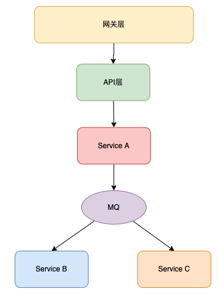

# 直播系统

## 微服务架构图

## 网关层

实现流量业务的转发，转发到对应的API。

### 网关层的作用：

1. **统一入口**：作为`live-api`之前的统一入口，使下游的微服务具备负载均衡和水平扩展的能力。
2. **服务注册与发现**：网关可以与微服务注册中心链接，实现微服务无感知动态扩容。
3. **自动熔断**：对于无法访问的服务，可以自动熔断，减少人工干预。
4. **权限验证**：对后端请求统一进行权限验证，确保关键请求需要登录后才能访问。

## API层

接收前端发来的`GET/POST`请求，与Dubbo对接，由Dubbo进行服务调用。

## 业务层

### ID生成

使用CosID进行统一的ID生成，支持两种方式：

- **雪花算法**：生成无序ID。
- **SegmentID**：生成有序的ID。

### 即时通讯

- **WebSocket**：基于WebSocket实现客户端与服务器的即时消息通讯。
- **RocketMQ**：通过RocketMQ实现异步消息传输，生产者发送消息和消费者消费消息的逻辑完全分离。同时，MQ可以暂存消息，逐步向业务方推送，避免大流量情况下业务方负载过大导致服务崩溃。

### 用户业务层

实现用户的注册、登录以及其他用户相关业务。

